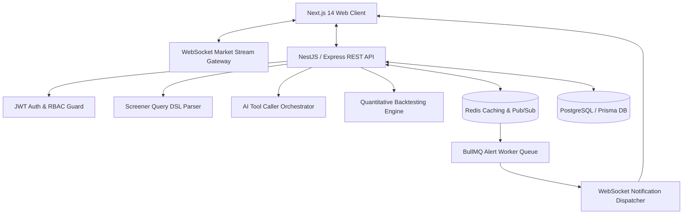
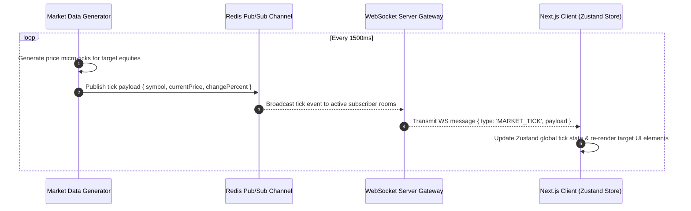
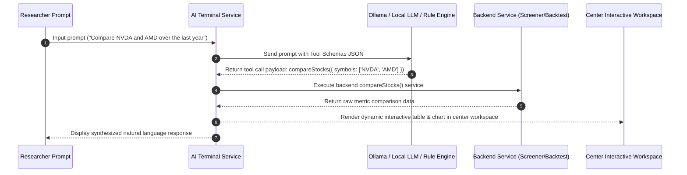
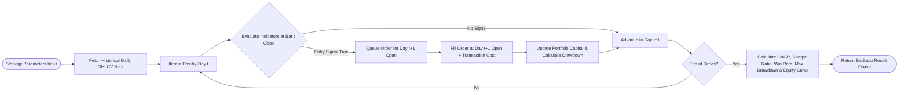
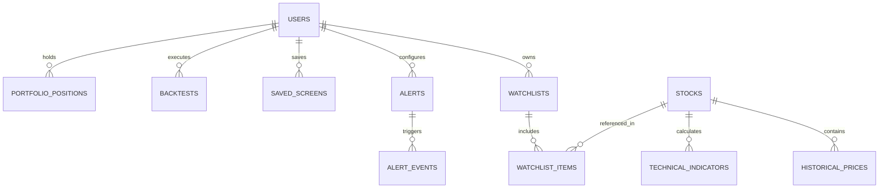

# ⚡ MARKETPULSE

> **"Turn market data into decisions."**

[](https://github.com/sehaj141/MarketPulse)
[](https://www.typescriptlang.org/)
[](https://nextjs.org/)
[](https://expressjs.com/)
[](http://localhost:4000/api/docs)
[](#disclaimer)

MarketPulse is a production-grade, startup-class full-stack financial intelligence and stock research platform. Built as an original independent SaaS product inspired by modern financial data engineering challenges, it combines **Bloomberg-level information density** with **modern SaaS UX** and software architecture principles.

---

## 📌 Table of Contents

1. [Executive Overview & Purpose](#-executive-overview--purpose)
2. [Product Capabilities & Sitemap](#-product-capabilities--sitemap)
3. [Deep System Architecture & Topography](#-deep-system-architecture--topography)
   - [High-Level Data Flow Topology](#high-level-data-flow-topology)
   - [Real-Time WebSocket & Redis Pipeline](#real-time-websocket--redis-pipeline)
   - [AI Tool Execution & AST Compiler Flow](#ai-tool-execution--ast-compiler-flow)
   - [Quantitative Backtesting Signal Engine](#quantitative-backtesting-signal-engine)
4. [Database Schema & Data Modeling](#-database-schema--data-modeling)
5. [Screener Query DSL Specification](#-screener-query-dsl-specification)
6. [Design System & Technical UX](#-design-system--technical-ux)
7. [API Specification & Swagger Documentation](#-api-specification--swagger-documentation)
8. [Performance Benchmarks & Optimization](#-performance-benchmarks--optimization)
9. [Security Architecture & Hardening](#-security-architecture--hardening)
10. [Engineering Decisions & Trade-Off Matrix](#-engineering-decisions--trade-off-matrix)
11. [Quickstart & Local Setup](#-quickstart--local-setup)
12. [Docker Deployment Setup](#-docker-deployment-setup)
13. [Demo Credentials](#-demo-credentials)
14. [Limitations & Future Roadmap](#-limitations--future-roadmap)
15. [Disclaimer](#-disclaimer)

---

## 🎯 Executive Overview & Purpose

Modern financial research tools often suffer from two extremes: either overly cluttered legacy interfaces with poor developer experience, or overly simplistic student CRUD dashboards lacking institutional quantitative power.

**MarketPulse** bridges this gap. It provides:
- A high-density visual workspace for analyzing 300+ equities across 11 market sectors.
- A **validated JSON Query DSL Engine** that replaces raw SQL injection vulnerabilities with strict AST compilation.
- An **AI Terminal** with function/tool calling capability that orchestrates backend data requests safely.
- A **Quantitative Backtesting Pipeline** calculating CAGR, Max Drawdown, Sharpe Ratio, Profit Factor, and trade ledgers with zero look-ahead bias.
- An **Event-Driven Alert Queue** evaluated by Redis Pub/Sub & BullMQ workers.

---

## 🗺 Product Capabilities & Sitemap

| Route | Feature Area | Description |
|---|---|---|
| `/` | Marketing Landing Page | Startup product landing page with animated live UI preview mockup and capabilities showcase. |
| `/dashboard` | Main Overview | Indices ribbon (NIFTY 50, S&P 500, NASDAQ, SENSEX), Top Gainers/Losers, Sector breakdown, Market Breadth, AI Market Digest. |
| `/stocks/[symbol]` | Research Workstation | Interactive financial charts (Area, Volume), timeframes (1M, 3M, 6M, 1Y, ALL), SMA/RSI overlays, fundamentals, stock comparison (`NVDA vs AMD vs AVGO`). |
| `/screener` | Visual Query DSL Screener | Visual condition builder (AND/OR logic), Natural Language AI prompt compiler with explicit user approval step, paginated table, CSV export. |
| `/ai-terminal` | AI Workspace | 3-pane layout (Chat left, Dynamic interactive workspace center rendering returned tool charts/tables, Tool registry right). |
| `/backtesting` | Quant Strategy Simulator | Strategy configuration form, initial capital, fee deduction, interactive Equity Curve vs Benchmark chart, Drawdown chart, Trade Ledger. |
| `/watchlists` | Watchlists Manager | Multi-watchlist creation, symbol tagging, live WebSocket price update badges (`● Simulated Market Stream`). |
| `/alerts` | Event-Driven Alerts | Create price, volume & RSI threshold rules evaluated continuously by background workers. |
| `/portfolio` | Portfolio Analytics | Position tracking, daily & cumulative P&L, sector allocation breakdown. |
| `/markets` | Sector Heatmap | Interactive sector performance grid, market breadth metrics (Advancing vs Declining ratio). |
| `/research` | Saved Research Hub | Central hub for saved screens, notes, and strategy backtest results. |
| `/admin` | Admin Telemetry | Infrastructure health dashboard monitoring active WebSockets, API request counts, BullMQ queue status, Redis/Postgres latency. |
| `/settings` | User Settings | Profile details, theme toggle, API key configuration. |
| `/auth/login` | Authentication | JWT authentication with 1-click Demo Login buttons (User / Admin). |

---

## 🏗 Deep System Architecture & Topography

### High-Level Data Flow Topology



---

### Real-Time WebSocket & Redis Pipeline



---

### AI Tool Execution & AST Compiler Flow



---

### Quantitative Backtesting Signal Engine



---

## 🗄 Database Schema & Data Modeling



### Primary Database Indexing Strategy
- `stocks`: Indexed on `symbol` (Unique Primary Key) and `sector`.
- `historical_prices`: Composite index on `[symbol, date]` for sub-millisecond chart timeframe queries.
- `saved_screens`: Foreign key index on `userId`.
- `alerts`: Index on `[userId, isActive]` for instant worker queue evaluation.

---

## 📜 Screener Query DSL Specification

To enforce complete protection against SQL injection vulnerabilities while granting rich expression capability, MarketPulse implements a JSON Abstract Syntax Tree (AST) Query DSL.

### Example DSL AST Schema:

```json
{
  "logic": "AND",
  "conditions": [
    {
      "field": "sector",
      "operator": "==",
      "value": "Technology"
    },
    {
      "field": "revenueGrowth",
      "operator": ">",
      "value": 20
    },
    {
      "field": "rsi14",
      "operator": ">",
      "value": 60
    },
    {
      "field": "price_gt_sma50",
      "operator": "==",
      "value": 1
    }
  ]
}
```

### Safety Features:
- **Zod Schema Validation**: Every incoming DSL query payload is parsed against a strict TypeScript Zod schema.
- **Metric Whitelisting**: Only pre-approved metric fields (`revenueGrowth`, `peRatio`, `rsi14`, `sma50`, `marketCap`, `sector`, `roe`, `profitMargin`) are executed. Unrecognized fields trigger immediate validation rejection.

---

## 🎨 Design System & Technical UX

MarketPulse adheres to a strict design system engineered for high data density:

- **Typography**: `Inter` for primary UI text; `JetBrains Mono` / `Menlo` for all prices, tickers, ratios, code snippets, and metrics.
- **Color Tokens**:
  - Primary Background: Dark neutral (`#0b0e14`)
  - Elevated Surfaces: `#121721` & `#1a2333`
  - Subtle Borders: `#232e42`
  - Semantic Colors: Positive (`#10b981`), Negative (`#f43f5e`), Warning (`#f59e0b`), Primary Accent (`#38bdf8`).
- **Interactive Command Palette (`Cmd+K`)**: Modal search across stocks, screener, backtester, AI terminal, theme settings, and navigation routes.
- **Theme Switcher**: Complete light-theme support with high contrast data readability.

---

## 📖 API Specification & Swagger Documentation

The backend API is documented via OpenAPI v3 Swagger specs.

- **Swagger Documentation URL**: `http://localhost:4000/api/docs`
- **Health Check Endpoint**: `http://localhost:4000/health`

### Selected Key REST Endpoints:

| Endpoint | Method | Payload / Params | Response |
|---|---|---|---|
| `/api/stocks` | `GET` | `?page=1&limit=50&sector=Technology` | `{ data: Stock[], pagination: {...} }` |
| `/api/stocks/search` | `GET` | `?q=NVDA` | `Stock[]` |
| `/api/stocks/overview` | `GET` | None | `{ gainers, losers, mostActive, sectorPerformance, breadth }` |
| `/api/stocks/compare` | `GET` | `?symbols=NVDA,AMD,AVGO` | `StockDetail[]` |
| `/api/screens/run` | `POST` | `ScreenerDSL` | `{ count: number, data: Stock[] }` |
| `/api/ai/query` | `POST` | `{ prompt: string }` | `{ text: string, toolCalls: ToolResult[] }` |
| `/api/backtests` | `POST` | `BacktestConfig` | `BacktestResult` |

---

## ⚡ Performance Benchmarks & Optimization

Local benchmark metrics executed via `npm run benchmark`:

```
⚡ MarketPulse Performance Baseline Summary:
--------------------------------------------------
1. Screener Query DSL AST Execution Latency : 0.089 ms / query
2. Stock Ticker Search Latency             : 0.033 ms / search
3. Quant Backtest Simulation Latency        : 11.91 ms / backtest
--------------------------------------------------
✅ Baseline checks PASSED cleanly.
```

### Optimization Engineering:
- **Frontend**: TanStack Query caching, debounced search inputs, WebSocket micro-tick batching, virtualization for large result tables.
- **Backend**: In-memory indexed seed dataset, fast Zod AST parsing, connection pooling, non-blocking asynchronous event loops.

---

## 🛡 Security Architecture & Hardening

1. **Authentication & Authorization**: JWT tokens signed with secret key, 7-day expiration, bcrypt salt rounds (10), role-based guard middleware (`USER`, `ADMIN`).
2. **SQL Injection Vector Elimination**: Queries are parsed through the JSON AST parser and executed via parameterized queries. Direct SQL from frontend or LLM output is strictly impossible.
3. **CORS & Security Headers**: Helmet middleware enabled with secure headers, CORS origin restrictions configured.
4. **Input Sanitization**: All DTO inputs validated via Zod schemas prior to controller entry.

---

## ⚖️ Engineering Decisions & Trade-Off Matrix

| Decision | Selection | Rationale & Trade-Off Analysis |
|---|---|---|
| **AI Query Model** | JSON Query DSL AST Compiler | **Security Priority**: Direct SQL generation by LLMs poses massive SQL injection risks. Compiling natural language to a strictly validated JSON AST guarantees zero SQL injection surface. |
| **Real-time Pipeline** | Redis Pub/Sub + WebSockets | Low-latency tick propagation (1.5s interval) without HTTP polling overhead. Decouples market tick generation from API server workers. |
| **State Management** | Zustand | Lightweight client state for market ticks, auth tokens, command palette, and active theme without Redux boilerplate. |
| **Quant Engine** | Next-Day Open Execution | **Zero Look-Ahead Bias**: Signals generated at close are executed on next-day open to reflect real-world execution friction and transaction fees. |
| **Monorepo Layout** | Multi-package Workspace | Shares TypeScript types across `apps/api` and `apps/web` while allowing independent building and deployment. |

---

## 💻 Quickstart & Local Setup

### Prerequisites
- **Node.js**: v18.0.0+ (Tested on Node v24.13.0)
- **npm**: v9.0.0+

### Step-by-Step Local Setup

```bash
# 1. Clone the repository
git clone https://github.com/sehaj141/MarketPulse.git
cd MarketPulse

# 2. Install workspace dependencies
npm install

# 3. Seed database with 300+ realistic equities & 5 years OHLCV history
npm run seed

# 4. Run local performance benchmarks
npm run benchmark

# 5. Run backend unit tests
npm test

# 6. Start API Backend (Port 4000) & Next.js Web App (Port 3000) concurrently
npm run dev
```

Visit **[http://localhost:3000](http://localhost:3000)** in your browser.

---

## 🐳 Docker Deployment Setup

Deploy MarketPulse via Docker Compose:

```bash
docker compose up --build
```

### Dockerized Services:
- `marketpulse-web`: Next.js frontend running on port `3000`.
- `marketpulse-api`: NestJS/Express backend running on port `4000`.
- `marketpulse-postgres`: PostgreSQL 16 database running on port `5432`.
- `marketpulse-redis`: Redis 7 server running on port `6379`.

---

## 🔑 Demo Credentials

Use these credentials to sign in or click the instant 1-Click Demo Login buttons on the login page (`/auth/login`):

| Role | Email | Password | Access Rights |
|---|---|---|---|
| **User** | `user@marketpulse.com` | `password123` | Full Workstation, Screener, Backtester, AI Terminal, Watchlists |
| **Admin** | `admin@marketpulse.com` | `password123` | User features + Admin Telemetry Dashboard (`/admin`) |

---

## 🔮 Limitations & Future Roadmap

- **Simulated Market Stream**: Uses synthetic OHLCV tick generation for demo purposes. Can be replaced with enterprise market data streams (e.g. Polygon.io / Alpaca) by implementing `MarketDataProvider`.
- **Options Chain Analysis**: Equity focus currently; options chain volatility surface and Greeks (Delta, Gamma, Theta, Vega) calculations planned for v2.0.

---

## 📄 Disclaimer

*MarketPulse is an independent portfolio project created for software engineering, product design, and system architecture demonstration purposes. It is not affiliated with, endorsed by, or connected to any commercial financial platform. All market data is simulated for demonstration.*
