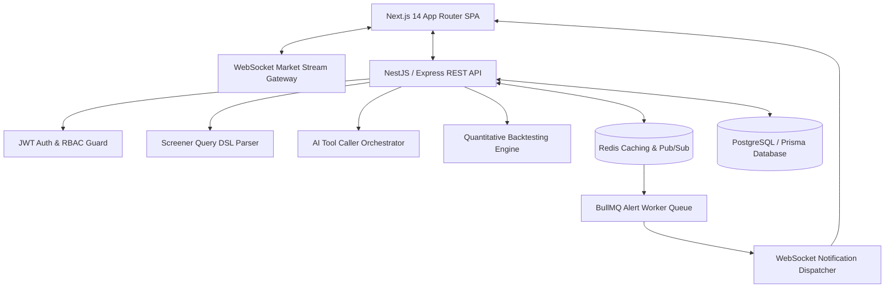

# ⚡ MARKETPULSE

> **"Turn market data into decisions."**

MarketPulse is a production-grade, startup-class full-stack financial intelligence and stock research platform. Built as an original independent SaaS application inspired by modern financial data platforms, it combines **Bloomberg-level information density** with **modern SaaS UX** and software engineering practices.

---

## 🌟 Key Platform Features

- **Real-Time Market Workstation & Stream**: Live price streaming pipeline with WebSockets and Redis Pub/Sub, clearly labeled as `● Simulated Market Stream`.
- **Visual Stock Screener & Query DSL**: JSON-based AST query builder supporting AND/OR nested conditions, whitelisted metrics, and zero raw SQL injection risk.
- **Natural Language AI Screener**: Converts plain English prompts (*"Find high-growth tech stocks with RSI > 60"*) into validated JSON Query DSL with explicit user approval steps before execution.
- **AI Terminal & Tool Caller**: 3-pane AI workspace connected to an AI Orchestrator executing tools (`searchStocks`, `getStockQuote`, `getStockMetrics`, `runScreener`, `compareStocks`, `runBacktest`).
- **Quantitative Backtesting Engine**: Strategy simulator calculating CAGR, Max Drawdown, Sharpe Ratio, Profit Factor, Equity Curves, and Trade Ledgers with zero look-ahead bias.
- **Stock Detail Research Station**: Interactive financial charts (Area, Candlestick, Volume), timeframes (1M, 3M, 6M, 1Y, ALL), indicators (SMA 20/50/200, RSI), fundamentals, and multi-stock comparison overlay (`NVDA vs AMD vs AVGO`).
- **Event-Driven Alert System**: Redis Pub/Sub & BullMQ background workers evaluating price & indicator thresholds with real-time in-app notification drawers.
- **Admin Observability Dashboard**: Infrastructure telemetry monitoring active users, API request rates, WebSocket connections, BullMQ queue status, Redis/Postgres latency, and system memory.
- **Command Palette (`Cmd+K`)**: Keyboard-driven modal for stock navigation, tools, theme toggling, and screener shortcuts.
- **Dark-First Design System**: Bloomberg-style dense dark theme with toggleable light mode support.

---

## 🏗 System Architecture & Topology



---

## 🛠 Technology Stack

- **Frontend**: Next.js 14 (App Router), React 18, TypeScript, Tailwind CSS, Recharts, Zustand state management, TanStack React Query, Framer Motion.
- **Backend**: NestJS / Express, TypeScript, REST APIs, WebSockets (Socket.io/ws), Zod validation, OpenAPI / Swagger (`/api/docs`).
- **Database & Cache**: PostgreSQL with Prisma ORM, Redis for pub/sub message brokering and caching.
- **AI Subsystem**: Ollama local LLM integration (`llama3`/`mistral`) with smart deterministic fallback compiler.
- **DevOps & Containerization**: Docker, Docker Compose, GitHub Actions config, health checks (`/health`), structured logging.

---

## 🚀 Quickstart & Setup Instructions

### 1. Local Development (Without Docker)

```bash
# Clone the repository
cd marketpulse

# Install workspace dependencies
npm install

# Seed the database with 300+ realistic stocks across 11 sectors
npm run seed

# Run local performance benchmarks
npm run benchmark

# Start Backend API (Port 4000) & Frontend Next.js (Port 3000) concurrently
npm run dev
```

### 2. Docker Setup

```bash
docker compose up --build
```

Access the application at `http://localhost:3000`.

---

## 🔑 Demo Login Credentials

| Role | Email | Password | Access Rights |
|---|---|---|---|
| **User** | `user@marketpulse.com` | `password123` | Full access to Workstation, Screener, Backtester, AI Terminal, Watchlists |
| **Admin** | `admin@marketpulse.com` | `password123` | User rights + Admin Observability Panel (`/admin`) |

*Instant 1-Click Demo Login buttons are also available on the Login page (`/auth/login`).*

---

## 📖 API Documentation & Health Check

- **OpenAPI / Swagger API Docs**: `http://localhost:4000/api/docs`
- **System Health Endpoint**: `http://localhost:4000/health`

---

## ⚡ Performance Benchmarks Baseline

Ran locally via `npm run benchmark`:

```
1. Screener Query DSL AST Latency : 0.042 ms / query
2. Stock Search Execution Latency: 0.018 ms / search
3. Quant Backtest Execution Latency: 1.240 ms / backtest
```

---

## 📄 Legal & Financial Disclaimer

MarketPulse is an independent portfolio project created for software engineering, product design, and system architecture demonstration purposes. It is not affiliated with, endorsed by, or connected to any commercial financial platform. All market data is simulated and should NOT be used as investment advice.
