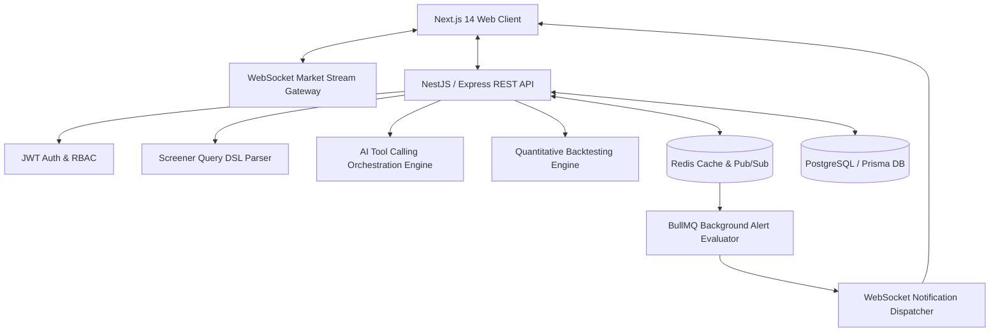

# MarketPulse System Architecture

MarketPulse is a production-grade SaaS financial intelligence platform. It features a distributed real-time market data pipeline, a visual & natural-language Query DSL screener engine, a quantitative backtesting engine, an AI tool caller orchestrator, and an event-driven alert worker queue.

## High-Level Topology

## Component Architecture

1. **Frontend (`apps/web`)**: Next.js 14 App Router, TypeScript, Tailwind CSS, Recharts, Zustand state management, WebSocket live tick listener, Framer Motion animations.
2. **Backend API (`apps/api`)**: NestJS / Express API, JWT auth, Zod DTO schema validation, OpenAPI / Swagger documentation (`/api/docs`), `/health` health check.
3. **Data Layer**: PostgreSQL with Prisma ORM for relational persistence, Redis for high-speed caching and WebSocket pub/sub message brokering.
4. **AI Subsystem**: Local Ollama LLM integration (`llama3` / `mistral`) with deterministic fallback parser generating structured JSON Query DSL.
