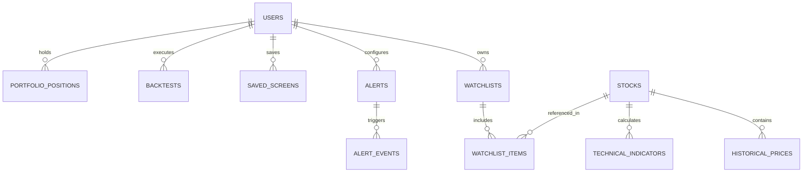

# MarketPulse Database Schema & ERD

## Relational Entity ERD

## Tables & Primary Indexes

1. **`stocks`**: `symbol` (PK, Unique Index), `companyName`, `sector`, `industry`, `marketCap`, `peRatio`, `eps`, `revenueGrowth`, `profitMargin`, `roe`, `debtToEquity`, `currentPrice`, `volume`.
2. **`historical_prices`**: `id`, `symbol` (FK), `date` (Composite Index `[symbol, date]`), `open`, `high`, `low`, `close`, `volume`.
3. **`technical_indicators`**: `symbol` (PK/FK), `sma20`, `sma50`, `sma200`, `ema20`, `rsi14`, `macd`, `bbUpper`, `bbLower`, `atr14`.
4. **`saved_screens`**: `id` (PK), `userId` (FK), `name`, `queryDsl` (JSONB), `isPublic`.
5. **`alerts`**: `id` (PK), `userId` (FK), `symbol`, `metric`, `operator`, `threshold`, `isActive`.
6. **`backtests`**: `id` (PK), `userId` (FK), `strategyName`, `totalReturnPercent`, `cagrPercent`, `maxDrawdownPercent`, `equityCurveJson`, `tradesJson`.
